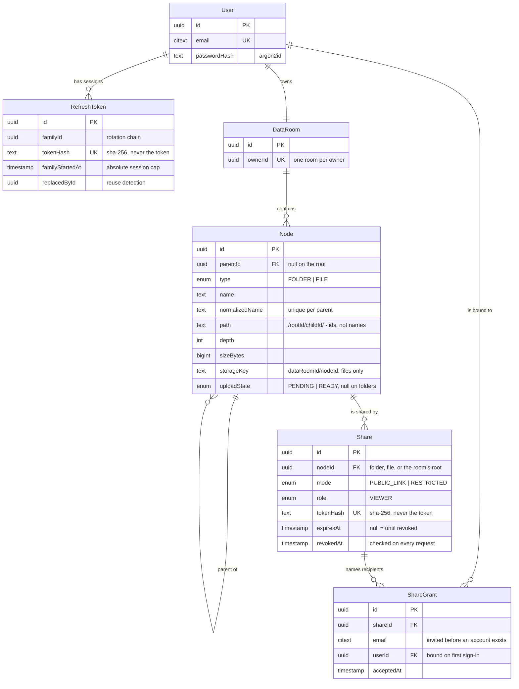

# Data Room

A virtual Data Room: an owner keeps folders and PDF documents in a private repository and shares them read-only — by public link, or with specific people — for due diligence.

Built for the GS1 full-stack take-home task.

> **Status:** authentication, folders, files and sharing are implemented and deployed. Search and versioning — the task's extra credit — were cut for time; see [Deliberate cuts](#deliberate-cuts).

## Hosted URLs

|              | URL                                                           |
| ------------ | ------------------------------------------------------------- |
| Frontend     | <https://data-room-web-sigma.vercel.app>                      |
| Backend      | <https://data-room-production-1752.up.railway.app>            |
| Health check | <https://data-room-production-1752.up.railway.app/api/health> |

### What to try first

1. **Register** — any email and a password of eight characters or more. There is no email
   confirmation step; the account is usable immediately.
2. **Make a folder or two, and nest one inside another.** Try creating a second folder with the
   same name — the conflict is refused with the name it collided with.
3. **Drag a few PDFs onto the folder.** Each gets its own progress row. Dropping the same file
   twice resolves to `name (1).pdf` rather than overwriting.
4. **Open one**, rename it — the extension is not editable — then move it to another folder.
5. **Delete a folder that has things in it.** The confirmation states the real counts from the
   server before anything is destroyed.
6. **Share the folder**, copy the link, and open it in a private window. You will see the shared
   folder and everything under it, and no way to change any of it. Then revoke the share and
   reload: it is gone on the next request.

Only PDFs are accepted, up to 50 MB.

## What it does

- **Folders** — create, nest, rename, and delete with a warning that states exactly how many folders and files will be removed. Breadcrumb navigation at any depth.
- **Files** — upload several PDFs at once by drag-and-drop with per-file progress, view them in the app, rename, move between folders, delete. Name conflicts resolve predictably.
- **Sharing** — share the Data Room, a folder, or a single file, read-only, either as a public link or to named people who must sign in. Access covers everything nested inside. The owner can revoke at any time, immediately.
- **Accounts** — email and password. A Data Room is invisible to everyone but its owner until it is shared.

## Stack

|          |                                                                                        |
| -------- | -------------------------------------------------------------------------------------- |
| Frontend | Next.js 15 (App Router), React, TypeScript, Tailwind, shadcn/ui, TanStack Query        |
| Backend  | NestJS 11, Prisma, PostgreSQL                                                          |
| Storage  | Supabase — Postgres and Storage                                                        |
| Auth     | Argon2id passwords, JWT access + rotating refresh in httpOnly cookies                  |
| Testing  | Jest (units, services) and Cypress (API, components, end-to-end)                       |
| Hosting  | Vercel (web), Railway or Render (api), Supabase (data and blobs)                       |

## Design decisions

Each of these is argued in full, with the alternatives weighed against it, in the design document of the change that made it: `openspec/changes/*/design.md`.

- **One `Node` table for folders and files**, discriminated by type, so naming, listing, moving, deleting and sharing are each implemented once rather than twice.
- **Materialised path of ids** on every node, so breadcrumbs, subtree aggregates, recursive delete, scoped search and permission inheritance are all one indexed prefix query — and a rename touches a single row.
- **Uploads bypass the API.** The browser sends bytes straight to blob storage through a short-lived signed URL; the API reserves the name first and validates the stored object afterwards.
- **One access resolver** that every read passes through. Sharing is read-only by construction: no code path lets a share authorise a write.

## Data model



Three things in that diagram carry most of the weight.

**`Node` is one table for folders and files**, discriminated by `type`. Naming, listing, moving,
deleting and sharing are each implemented once rather than twice, and a `Share` can point at a
folder or a file without a polymorphic target.

**`path` holds ancestor ids, not names.** It is what makes a subtree one indexed range scan, and
it is why renaming a folder with fifty thousand descendants updates exactly one row.

**The Data Room's root is a real `Node` row.** Sharing the whole room is therefore the same
operation as sharing a folder — there is no second code path for it.

## How it scales

**How do you compute the total size and item count of a folder including its whole subtree?**

Every node stores a materialised path of ancestor **ids** — `/<rootId>/<childId>/` — alongside its
depth. A subtree is therefore a string prefix, and the aggregate is one indexed range scan:

```sql
SELECT count(*) FILTER (WHERE type = 'FILE')   AS files,
       count(*) FILTER (WHERE type = 'FOLDER') AS folders,
       coalesce(sum(size_bytes), 0)            AS bytes
FROM nodes
WHERE data_room_id = $1 AND path LIKE '/<root>/<folder>/%'
  AND (upload_state IS NULL OR upload_state = 'READY');
```

The index is `(data_room_id, path text_pattern_ops)`, and `text_pattern_ops` is what makes the
`LIKE 'prefix%'` a range rather than a scan. Verified against the real database with
`EXPLAIN`, which rewrites the predicate into exactly that:

```
Index Scan using nodes_data_room_path_prefix_idx on nodes
  Index Cond: (data_room_id = $1 AND path ~>=~ '/<root>/' AND path ~<~ '/<root>0')
```

Ids rather than names in the path is the decision that pays here: renaming a folder with fifty
thousand descendants updates one row, because no descendant's path mentions the name.

The trade-off is that the cost grows with subtree size. It is paid on the folder header and on
the delete confirmation, not on listing — and the next step, when the scan stops being cheap,
is a maintained rollup counter updated in the same transaction as the write. That is
deliberately not built: a counter that can drift is worse than a scan that cannot, and nothing
in this data set justifies the drift yet.

**What changes when one Data Room holds 100,000 files — listing, pagination, indexes?**

Nothing in the model. Four things carry the load.

*Listing stays per-folder and keyset-paginated.* The UI never asks for "every file in the Data
Room"; it asks for one folder's children, ordered by `(type, name, id)` with the cursor encoding
that tuple:

```sql
SELECT * FROM nodes
WHERE parent_id = $1 AND (type, name, id) > ($2, $3, $4)
ORDER BY type, name, id
LIMIT $5;
```

Cost is proportional to the page, never to the folder or the room. Deep offsets cannot appear
because there is no page-number affordance — the list is infinite scroll.

*The indexes are the ones the queries actually use.* `(parent_id, type, name, id)` for listing
and its cursor, unique `(parent_id, normalized_name)` for conflicts, and
`(data_room_id, path text_pattern_ops)` for aggregates and recursive delete. Every hot query is
an index range scan.

*Counts are not `COUNT(*)`.* A precise total across 100,000 rows on every folder open is wasted
work. The header shows the subtree aggregate above, and it is the first thing to become a
maintained rollup.

*The client renders a window, not a list.* 100,000 DOM rows is a frontend failure independent of
the database, so the contents list virtualises and fetches pages as the viewport advances.

Beyond that point: search moves from `ILIKE` to a trigram index, aggregates become counters, and
blob cleanup becomes a queued job rather than a best-effort call after commit.

**How does sharing extend to per-user roles (viewer/editor) without remodelling?**

The model is already role-shaped. `Share.role` and `ShareGrant.role` exist, so adding `EDITOR`
adds no table and no migration beyond an enum value.

What changes is *where the resolver is consulted*. Today read-only is enforced by shape rather
than by a role check: write endpoints keep their owner guard, and the access resolver is wired
only into read paths. A recipient cannot escalate because there is no code path in which a share
authorises a write. Adding editors means introducing one capability matrix —
`VIEWER: {read}`, `EDITOR: {read, create, rename, move, upload}` — having the write guards call
the same resolver instead of the owner check, and rendering controls from that same matrix
rather than from `isOwner`.

Two properties make this cheap. The grant is per-share and per-user, so two recipients of one
share can hold different roles. And resolution already returns the *most permissive* match, so
someone granted viewer on a Data Room and editor on one folder inside it gets exactly what you
would expect, with no special case.

It is deliberately deferred: a role that is not enforced on every path is worse than no role at
all.

## Setup

Prerequisites: Node 22 (see `.nvmrc`) and pnpm 11 (`corepack enable pnpm`).

```bash
pnpm install
cp apps/api/.env.example apps/api/.env      # fill in the Supabase connection strings
cp apps/web/.env.example apps/web/.env.local
pnpm --filter @data-room/shared build
pnpm --filter @data-room/api prisma:generate
pnpm --filter @data-room/api prisma:deploy
pnpm dev                                     # web on :3000, api on :3001
```

The API validates its environment at boot and exits with the name of anything missing, so a
half-configured start fails immediately rather than at the first request.

For provisioning Supabase, Vercel and the API host, follow **[docs/deployment.md](docs/deployment.md)** — a step-by-step runbook with a verification after each stage.

## Environment

Every variable is declared in one zod schema per app and read only through a typed config
service — nothing else touches `process.env`. The API validates at boot and **exits naming
whatever is missing**, so a half-configured deploy fails loudly instead of serving confusing
errors at the first request.

Copy `apps/api/.env.example` → `apps/api/.env` and `apps/web/.env.example` →
`apps/web/.env.local`.

**`apps/api`**

| Variable          | Notes                                                                                                              |
| ----------------- | ------------------------------------------------------------------------------------------------------------------ |
| `NODE_ENV`        | `development` \| `test` \| `production`                                                                            |
| `PORT`            | Defaults to 3001. Leave unset on a host that injects it.                                                           |
| `DATABASE_URL`    | Pooled connection used at runtime (Supabase port 6543, `?pgbouncer=true`)                                          |
| `DIRECT_URL`      | Direct connection for migrations (port 5432) — a transaction pooler cannot hold the session `prisma migrate` needs |
| `WEB_APP_URL`     | Where the browser app runs; OAuth redirects return here                                                            |
| `CORS_ORIGINS`    | Comma-separated origins allowed to send credentialed requests                                                      |
| `COOKIE_SECURE`   | `false` locally, `true` in production                                                                              |
| `COOKIE_SAMESITE` | `lax` locally, `none` in production                                                                                |

**`apps/web`**

| Variable              | Notes                                        |
| --------------------- | -------------------------------------------- |
| `NEXT_PUBLIC_API_URL` | The API base **including the `/api` suffix** |

Two of these are worth understanding rather than copying:

- **Cookie policy is configuration, not code.** Production is genuinely cross-site — Vercel
  calling the API host — so it needs `SameSite=None`, which browsers accept only alongside
  `Secure`, which needs HTTPS. Locally the two differ only by port, and a port is not part of
  a _site_, so `Lax` without `Secure` is both sufficient and correct. `httpOnly` is
  unconditional in every environment.
- **Origins are compared exactly.** A trailing slash on `CORS_ORIGINS` would match nothing,
  because a browser's `Origin` header never carries one; the schema strips it rather than
  leaving a one-character trap whose only symptom is that every browser request fails while
  `curl` keeps working.

Secrets never reach the browser: only `NEXT_PUBLIC_`-prefixed values are readable client-side,
and nothing prefixed that way may be a credential.

## Testing

Jest and Cypress only.

```bash
pnpm test    # Jest — services, permission resolution, pure logic
pnpm e2e     # Cypress — API end-to-end, component tests, user flows
```

## How this was built

This repository is specified with [OpenSpec](https://github.com/Fission-AI/OpenSpec) before it is coded. Each capability is a change proposal holding a proposal, capability specs written as testable scenarios, a design document recording the decisions and their alternatives, and a task list.

```bash
openspec list                    # changes and progress
openspec show add-sharing        # read one
openspec validate --all --strict
```

Conventions live in `.claude/rules/*.md` and load automatically for the files they govern; `CLAUDE.md` files carry orientation only. Formatting, test companionship, post-commit test runs and post-archive documentation checks are hooks, so they happen without anyone remembering them.

### What shipped

Each change was built, verified and archived in order. An archived change's specs are folded
into `openspec/specs/`, which is therefore a description of the system as it stands rather than
of what was once intended.

| Order | Change                      | Delivered                                             | Status                    |
| ----- | --------------------------- | ----------------------------------------------------- | ------------------------- |
| 1     | `add-project-foundation`    | monorepo, contract, env, health, CI, deployment        | archived                  |
| 2     | `add-authentication`        | email/password sessions, rotation, route guards        | archived                  |
| 3     | `add-data-room-tree`        | Data Room, folders, breadcrumbs, recursive delete      | archived                  |
| 4     | `add-file-management`       | upload, view, rename, move, delete                     | archived                  |
| 5     | `add-sharing`               | public links, permissioned grants, revocation          | archived                  |
| 6     | `add-search-and-versioning` | filename search, versioning                            | specified, cut — see below |

The task lists of the archived changes record what was cut and why, next to the task it was cut
from — the Cypress specs in particular, each with the manual verification that stood in for it.

## Use of AI

This project was built with Claude Code, and the honest summary is that AI wrote nearly all of
the code and none of the decisions that mattered.

**How the work was structured.** Every feature started as an OpenSpec change — a proposal, a
design document arguing the alternatives, a spec with testable scenarios, and a task list —
reviewed before any code existed. That ordering is what made AI useful at this size: the
specification is the thing under human control, and the implementation is the part that can be
delegated and checked.

**Where it was delegated.** Each change was built by several agents working in parallel against
a written contract fixing the shared signatures — the zod schemas, the service interfaces, the
routes — so four agents could touch four areas without inventing four versions of the same
type. That contract was written by hand, after an attempt to have an agent produce it failed
repeatedly.

**Where it needed correcting.** Parallel agents reliably produce integration defects that no
unit test catches, because each one is locally correct. Real examples from this repository:
three agents independently defined the same error class; a controller was written and
registered in no module, so an entire feature returned 404; a service gained a constructor
dependency that seventy-two existing tests did not provide.

**What the tests did not catch.** Two of the most serious defects were found by running the
application, not by the suite. A `POST /files/:id/move` that failed on every call — Prisma binds
a JS number as `bigint`, and Postgres has no `substring(text, bigint)` — while all 348 API tests
passed, because they mock Prisma and the SQL never reached a database. And an entire end-to-end
suite that had silently stopped running: a `tsconfig` inherited an `exclude` naming its own
input directory, so the project had no files, and "0 failing" looked exactly like passing.

**What AI was good at.** Volume with consistency — a data model, its migration, repository,
service, controller and specs written to the same conventions across four features. Adversarial
review was the other genuine win: a security pass over the authentication code found a login-CSRF
hole, a sign-out that never revoked anything, and a rate limiter bucketing every caller into one
counter, all while the suite was green.

**What it was not good at.** Knowing when it was wrong. Every claim in this repository that
something works was re-checked by running it, and that habit found defects in roughly every
change. Several agent runs also consumed large amounts of work and reported nothing usable.

## Deliberate cuts

Left out on purpose, with the reason rather than an apology:

| Cut | Why |
| --- | --- |
| **Search and file versioning** | The task marks both as extra credit. Specified in `add-search-and-versioning` and not built. |
| **Google sign-in** | The task asks for Google *or* email and password, and email and password is what shipped. The half-built column and its unique index were removed rather than left as a promise nothing kept — adding a provider later is one additive migration against a table where no row ever held a value. |
| **Password reset and email verification** | Both need transactional email, which is an integration rather than a feature of this product. |
| **Emailing share invitations** | Same reason. A restricted share returns its link to the owner, who sends it however they already talk to that person. |
| **Editor role** | `Share.role` and `ShareGrant.role` exist and the resolver already returns the most permissive match, so this is an enum value and a capability matrix — but a role enforced on some paths and not others is worse than no role, so it is deliberately unbuilt. See ["How it scales"](#how-it-scales). |
| **Access logs** | A real data room records who opened what. It is a table and a write on the read path; nothing in the model resists it. |
| **Throttling of share-token probing** | Tokens are 256 bits from a CSPRNG, so guessing is infeasible, and unknown, revoked and expired tokens are answered identically. A rate limit on the public surface is still the right belt-and-braces and is not implemented. |
| **Some Cypress API and component specs** | The logic underneath each is covered by Jest and the journeys by end-to-end specs. Each cut is recorded, with its reason, in the `tasks.md` of the change that owns it. |
